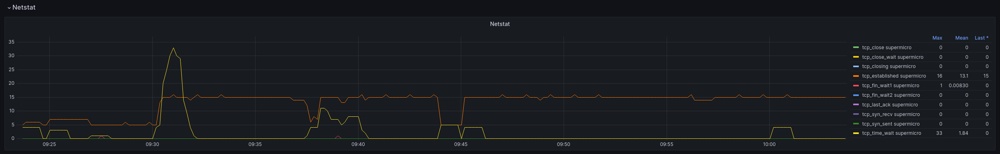

# Grafana Dashboard for Telegraf with flux queries (influxdb_v2)

Visualise health and usage data gathered by Telegraf:
- Host System Metrics
- Docker Engine and Docker Container Metrics

The data is stored in an influxdb 2.x and queried using Flux.

## Included in the package

- **ansible_gist.yaml** - install and configure telegraf, including mod to sudoers file to allow telegraf to run /usr/sbin/smartctl and /usr/sbin/nvme.
- **telegraf.conf** - to send all required metrics to influxdb_v2 to drive the dashboard
- **grafana_dashboard.json** - the dashboard definition

## Installation and usage

- Modify the **telegraf.conf** to include your influxdb_v2 installation in the '[[outputs.influxdb_v2]]' section. 
  - You may want to disable 'insecure_skip_verify = true' in case you don't use self-signed certificates.
- Install telegraf on the to-be-monitored host and use the above **telegraf.conf** configuration file to configure telegraf. This will provide all the required, and only those, parameters to the influxdb_v2.
- On a Graphana instance with the influxdb_v2 configured as data source, create a new dashboard and select 'import'
  - select 'upload dashboard JSON file' and select the **grafana_dashboard.json** from this repository
  - select the influsdb_v2 data source where telegraf is sending it's metrics to
  - Open the dashboard and at the top select the bucket to which telegraf is sending it's metrics to
  - Review all the metrics and collapse or delete the sections not relevant to you, or where your setup does not provide dat.

At this point the dashboard and it's variables should explore the schema and data in the bucket and find all hosts and devices for which metrics are available.
The telegraf installation can be rolled out to a fleet of servers or PCs and all of them monitored in one dashboard. The **ansible_gist.yaml** in this repository allows automated rollout of the telegraf installation to more hosts by using ansible.

## Upgrading

### Dashboard

If a new release tag comes out, simply create a new dashboard and import the updated dashboard.json file. This provides a new dashboard with all the features.

### Telegraf configuration

In case there were changes to the gathered data (which may well be the case on any major release tag), replace the telegraf.conf file with the new version and restart the telegraf service (or execute the command in the ansible_gist.yaml to automate the process).

## Screenshots

## Contributing

- Please report bugs as issues on GitHub. If you have an idea how to improve it, please include that too!
- I'm not convinced the structure of the dashboard json file lends itself well for pull requests and it may be simpler to just add a description and maybe a picture to a comment when asking for features.

## Dashboard export

It is possible to review and modify the 'json model' of the dashboard in the dashboard settings. However, this json representation of the dashboard is not portable to other installations. In order to create a 'generalised' export, wich can be imported on other systems, these steps must be taken:

- In Grafana click the 'Share dashboard or panel' button in the top left cordner (three connected circles)
- Select 'export'
- Enable 'Export for sharing externally'
- Select 'Save to file'

## License

MIT

## Author

Created in 2023 by Damian Hurschler